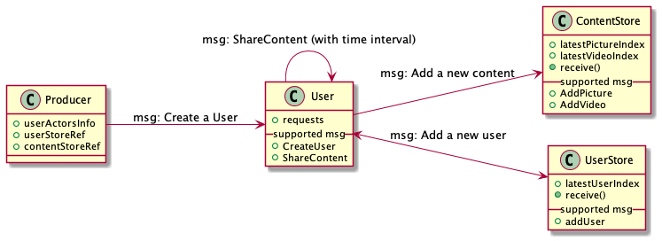

# Social Media Data Analytics Platform

Social Media Data Analytics Platform simulates social media data emission from various devices (web, mobile and tablets) and handles all the real-time data involved to perform BI analytics on the raw data stored in the MySQL database

### Data emission simulation
The producer is a multiprocessing (potentially also distributed) application which randomly create users and simulate interactions with the social media app.
It should emit sign-up message to Kafka for new users and should simulate a random amount of event such as likes, comments, friend requests, friend acceptance. 

#### Types of events
Here are the events messages that will be store in MySQL
- sign-ups
- friend requests
- friend requests acceptances
- pictures
- videos

### Data Analytics Architecture

<kbd>
    
</kbd>

### Producer App

#### Architecture
The Producer architecture is based on the Actor model. We use the actor model to have the app segmented in different parts that run in parallel.
Each of the component you can see bellow run in the parallel and communicate with each other with typed messages.

In order to avoid too many database access, we keep information about user ids and image/video ids in the UserStore and the ContentStore.
Every users can send messages to the UserStore and the ContentStore. They are the one which manage the IDs of the users' content, generate the fake data and deliver message to Kafka.
Using the Actor model makes the app more scalable (since it can be distributed to multiple machines) and handles pretty well the concurrency of the ressources (in our case the users ids and content ids)

