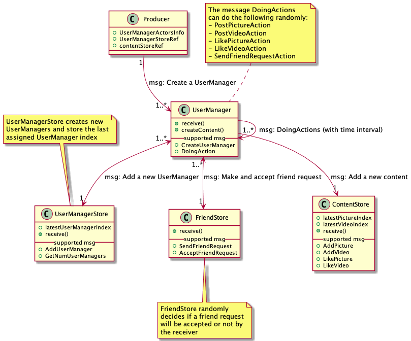

# Social Media Data Analytics Platform

Social Media Data Analytics Platform simulates social media data emission from various devices (web, mobile and tablets) and handles all the real-time data involved to perform BI analytics on the raw data stored in the MySQL database

### Data emission simulation
The producer is a multiprocessing (potentially also distributed) application which randomly create users and simulate interactions with the social media app.
It should emit sign-up message to Kafka for new users and should simulate a random amount of event such as likes, comments, friend requests, friend acceptance. 

#### Types of events
Here are the events that will be store in MySQL
- sign-ups
- friend requests
- friend requests acceptances
- pictures
- videos
- pictures likes
- video likes

### Data Analytics Architecture

<kbd>
    
</kbd>

### Producer App

#### Architecture
The Producer architecture is based on the Actor model. We use the actor model to have the app segmented in different parts that run in parallel.
Each of the component you can see bellow run in the parallel and communicate with each other with typed messages.

On startup the program will create a certain number of users which will be instanciated by creating an instance of the User class (being an Actor) at random times.
The creation of users, media content (pictures and videos data), friendRequests are done by dedicated classes (actors) which create fake data and send them to Kafka.
The UserStore and the ContentStore keep the lastest index of created content to keep track of the ids that have been assigned in order to avoid database access to produce foreign key that makes sense.

All the scheduling of different actions (sharing and liking content, adding friends) is done in the User class. It send messages to other actors to have random actions to be done at random times.

